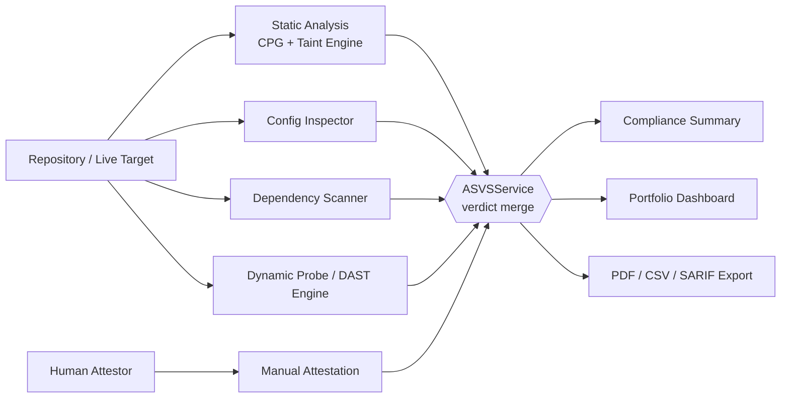

<p align="center">
  
</p>

<h1 align="center">ControlGate — Backend</h1>
<p align="center"><b>Scan. Verify. Comply.</b><br/>Automated OWASP ASVS 5.0.0 verification engine and hybrid attestation platform.</p>

<p align="center">
  
  
  
  
  
</p>

---

## Table of contents

- [Overview](#overview)
- [Detection engines](#detection-engines)
- [Architecture](#architecture)
- [Tech stack](#tech-stack)
- [Project structure](#project-structure)
- [Getting started](#getting-started)
- [Configuration](#configuration)
- [Running with Docker](#running-with-docker)
- [API reference](#api-reference)
- [Testing](#testing)
- [Security notes](#security-notes)
- [Deployment checklist](#deployment-checklist)
- [Related repositories](#related-repositories)
- [License](#license)

## Overview

**ControlGate** is an automated application-security and compliance platform for teams that need continuous, evidence-backed verification against the **OWASP Application Security Verification Standard (ASVS) 5.0.0**.

This repository is the backend: a FastAPI service that scans a source repository and, optionally, a live deployment; runs the result through five independent, complementary detection modules; merges the evidence into one pass/fail/manual-review verdict per control; and serves the compliance summary, evidence, and exportable reports the [ControlGate frontend](../frontend/README.md) consumes.

The engine verifies against the **complete ASVS 5.0.0 catalog — all three verification levels (L1/L2/L3), 345 controls across 17 chapters** (`app/data/asvs_l1_controls.json`, `asvs_l2_controls.json`, `asvs_l3_controls.json`), seeded automatically on startup.

## Detection engines

| Module | Controls | What it checks |
|---|---|---|
| **Taint engine + rule catalog** (`semantic_engine/`, `queries/queries.json`) | 195 | AST/CFG/DFG static analysis (tree-sitter, multi-language) plus an 88-rule pattern catalog — injection, crypto, session/JWT handling, password policy, access control, and more. Every match is tagged `vulnerable` or `compliant` polarity and optionally re-judged by an LLM classifier to cut false positives. |
| **Manual attestation** (`app/api/routes/attestations.py`) | 109 | Human-submitted, evidence-backed answers for architecture/business-logic/documentation controls with no fully automatable signal. 45 of these are **hybrid-assisted**: a confirmed automated finding (static, live DAST, LLM capability check, or dependency CVE) can fail the control outright, but a clean automated result never passes it on its own — a human still closes it out. |
| **Config inspector** (`app/domain/analysis/config_inspector.py`) | 32 | Parses `.env`, YAML, Dockerfiles, and nginx/reverse-proxy config for HSTS, cookie flags, upload limits, charset, and script-execution exposure. |
| **Dynamic probe / DAST engine** (`app/domain/analysis/dynamic_probe.py`, `app/domain/analysis/dast/`) | 8 tagged directly (broader live coverage feeds the hybrid-attestation bridge above) | Opt-in, live checks against a deployed URL/session: TLS/HSTS/cert trust, SSRF (out-of-band collaborator confirmation), IDOR/BOLA, mass assignment, race conditions, JWT algorithm-confusion forgery, DOM/stored/reflected XSS, redirect warnings, request smuggling, timing side-channels, WebRTC (DTLS/SRTP), signaling-server WebSocket fuzzing, padding-oracle detection — plus target discovery via same-origin crawling, headless-browser (Chromium) crawling for JS-rendered SPAs, and OpenAPI/Swagger spec-driven discovery for API-only targets. |
| **Dependency scanner** (`app/services/dependency_scanner.py`) | 1 | Parses manifests/lockfiles (`requirements.txt`, `package.json`, `package-lock.json`, `Pipfile.lock`, `pyproject.toml`) and queries the [OSV.dev](https://osv.dev) API against a documented remediation SLA, with optional NVD CVE enrichment. |

`app/services/asvs_service.py` merges all five sources into one `ASVSControlResult` per control — **a confirmed fail from any source always wins** — and aggregates the result into the compliance summary, portfolio dashboard, and exportable reports.

## Architecture



Two databases, each used for what it's good at:

- **SQLAlchemy + SQLite/PostgreSQL** — relational entities: users, scans, repositories.
- **MongoDB (Motor, async)** — document-shaped data: scan summaries, findings, the ASVS catalog, attestations.

Auth is a JWT in an **httpOnly cookie** set on login (falls back to a `Bearer` header for non-browser clients/scripts), so the token is never reachable from JavaScript. Three roles (`normal` / `premium` / `admin`) gate feature access and a daily scan quota.

## Tech stack

| Layer | Technology |
|---|---|
| API framework | FastAPI 0.128 (Starlette, Pydantic v2) |
| Relational data | SQLAlchemy 2.x (async) — SQLite by default, PostgreSQL-ready |
| Document data | MongoDB 7 via Motor |
| Static analysis | tree-sitter (multi-language CPG/AST/CFG/DFG), custom taint engine |
| Dynamic analysis | httpx, Playwright (Chromium), a purpose-built DAST probe suite |
| LLM classification | Provider-agnostic pool (GitHub Models by default, cascading fallback) |
| Auth | JWT (`python-jose`), `passlib`/`bcrypt`, httpOnly cookies |
| Reports | ReportLab (PDF) |
| Testing | pytest, pytest-asyncio |

## Project structure

```
Backend/
├── app/
│   ├── api/
│   │   ├── routes/         # auth, scans, asvs, attestations, reports, admin, graphs, ...
│   │   └── deps.py         # auth dependency (httpOnly cookie + Bearer fallback)
│   ├── core/                # config, security, permissions, rate_limit, crypto, archive
│   ├── db/                  # SQLAlchemy session + Mongo client + startup seeding
│   ├── domain/analysis/     # SAST engine (CPG/CFG/DFG/taint) + dast/ (DAST engine)
│   ├── enums/
│   ├── models/               # SQLAlchemy models
│   ├── schemas/                # Pydantic request/response schemas
│   ├── services/                # business logic — asvs_service, scan_service, ...
│   ├── assets/                   # brand assets used in generated PDF reports
│   └── main.py
├── semantic_engine/             # LLM-backed classifier + static query store
├── tests/                       # unit + integration tests, curated fixture sample apps
├── docker-compose.yml            # MongoDB service
├── Dockerfile
└── requirements.txt / requirements-cpg.txt
```

## Getting started

### Prerequisites

- Python 3.12
- MongoDB 7 (local, Docker, or Atlas)
- Git

### Installation

```powershell
python -m venv .venv; .\.venv\Scripts\Activate.ps1
pip install -U pip
pip install -r requirements.txt
pip install -r requirements-cpg.txt
playwright install chromium   # required for headless-browser DAST crawling / DOM-XSS probe
```

### Configuration

Copy the template and fill in real values before running anything beyond local dev:

```powershell
copy .env.template .env
```

| Variable | Required | Purpose |
|---|---|---|
| `JWT_SECRET` | **Yes** | Signs auth tokens and derives the repository-token encryption key. Startup fails hard if unset — never falls back to an insecure default. |
| `MONGO_HOST` / `MONGO_PORT` / `MONGO_DB_NAME` / `MONGO_USER` / `MONGO_PASSWORD` (or `MONGO_URI`) | Yes | MongoDB connection. |
| `DATABASE_URL` | No | Relational store — defaults to local SQLite; swap for a PostgreSQL DSN in production. |
| `BACKEND_CORS_ORIGINS` | Yes | Comma-separated origins allowed to call the API (must include the frontend's origin). |
| `DEFAULT_ADMIN_EMAIL` / `DEFAULT_ADMIN_PASSWORD` | Yes | Seeded on first startup — **rotate immediately** outside local dev. |
| `SMTP_*` / `SENDGRID_API_KEY` | For email flows | Password-reset emails. |
| `GOOGLE_OAUTH_*` / `GITHUB_OAUTH_*` | For OAuth login | Client ID/secret + redirect URIs. |
| `NVD_API_KEY` | Optional | Raises the CVE-enrichment rate limit from 5 to 50 req/30s. |
| `TRUSTED_PROXY_HOP_COUNT` | Optional | Number of trusted reverse-proxy hops in front of the app. Leave at `0` unless you control the exact proxy topology — trusting `X-Forwarded-For` blindly lets a client spoof its rate-limit identity. |

See `.env.template` for the full list.

### Run (development)

```powershell
docker compose up -d mongo   # or point at an existing MongoDB
uvicorn app.main:app --reload
```

Open **http://127.0.0.1:8000/docs** for the interactive API. On first startup the app seeds the full 345-control ASVS catalog into `asvs_controls` automatically.

**Default credentials** (change immediately outside local dev): `admin@controlgate.ai` / `admin123!`

## Running with Docker

```powershell
docker compose up -d mongo    # MongoDB, published on 127.0.0.1:27018
docker build -t controlgate-backend .
docker run --env-file .env -p 8000:8000 controlgate-backend
```

The image installs Chromium and its OS dependencies for the headless-browser DAST engine, and builds the tree-sitter grammars used by the static analysis engine at build time.

## API reference

All routes are under `/api/v1`. Full interactive documentation (OpenAPI/Swagger) is served at `/docs`; health check at `GET /health`.

| Group | Path prefix | Covers |
|---|---|---|
| Auth | `/auth` | Register, login/logout, `me`, refresh, Google/GitHub OAuth, forgot/reset password |
| Dashboard | `/dashboard` | Summary, recent scans, notifications |
| Repositories | `/repositories` | CRUD, branches, file listing, ZIP/TAR upload (zip-slip/symlink-safe extraction, up to 200MB) |
| Scans | `/scans` | Start (optional live `target_url` enables the full DAST engine), WebSocket progress (`/ws/{scan_id}`), status, logs, summary, cancel, list, delete, diff-based scans, probe auto-discovery |
| ASVS catalog | `/asvs` | Controls, chapters, per-control latest result, cross-repo portfolio dashboard |
| Attestations | `/attestations` | Scan-scoped manual-attestation work queue, submit/list answers, evidence upload |
| Reports | `/reports` | List/get/export (JSON/CSV/SARIF/PDF), ASVS compliance view, scan comparison |
| Export | `/export` | ASVS compliance report as PDF |
| Graphs | `/graphs` | Real AST/CFG/DFG/CPG evidence viewer |
| Admin | `/admin` | User list, role management (admin only) |

## Testing

```powershell
pytest
```

Two things worth knowing before trusting a "failing" test:

1. This repo's `mongomock` version doesn't support `await db.x.find_one(...)` (returns a plain dict, which raises under `await`), and the app's startup lifespan needs a reachable MongoDB — any test spinning up a real `TestClient(app)` fails without one. Tests for the ASVS layer route around this with a hand-rolled async-compatible fake DB, or call handler functions directly.
2. `tests/integration/test_sample_app_scan.py` runs the full pipeline against two curated fixtures (`tests/fixtures/asvs_sample_apps/`) — one deliberately vulnerable, one clean — exercising the whole detection stack together on a realistic multi-file app. It documents two known, accepted false-positive classes rather than masking them.

## Security notes

This is a security product, so its own posture matters:

- **Auth tokens** live in an httpOnly cookie, never in `localStorage` — not readable by an XSS payload.
- **`JWT_SECRET` is mandatory** — the app refuses to start without it, rather than silently deriving keys from an empty default.
- **Repository archive extraction** is zip-slip and symlink-safe, with a hard size cap.
- **Rate limiting** keys on the direct socket peer by default; raising `TRUSTED_PROXY_HOP_COUNT` above `0` is an explicit, deliberate trust decision — only do it if you control the proxy topology in front of the app.
- **Manual attestation always requires proof** (an uploaded file or written evidence notes) — a bare pass/fail answer is rejected.
- **Automated evidence never silently passes a `manual_attestation` control** — the hybrid-attestation bridge is fail-only by design; see the Detection engines table above.

## Deployment checklist

- [ ] Set a strong, unique `JWT_SECRET`
- [ ] Rotate `DEFAULT_ADMIN_PASSWORD` (or disable the seeded account)
- [ ] Point `DATABASE_URL` at PostgreSQL, not SQLite
- [ ] Set `BACKEND_CORS_ORIGINS` to the exact production frontend origin(s)
- [ ] Configure `SMTP_*`/`SENDGRID_API_KEY` for password-reset email delivery
- [ ] Set `TRUSTED_PROXY_HOP_COUNT` only if a known reverse proxy sits in front of the app
- [ ] Serve behind TLS; the app itself does not terminate HTTPS

## Related repositories

- [ControlGate Frontend](../frontend/README.md) — the React single-page app this API serves.

## License

Proprietary — all rights reserved.
